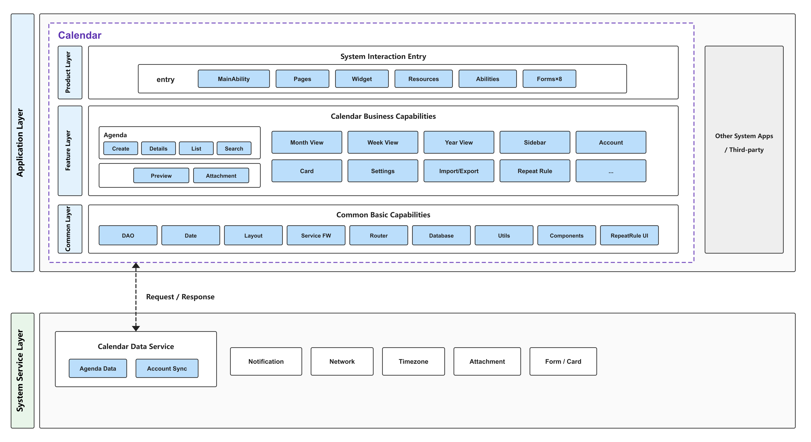
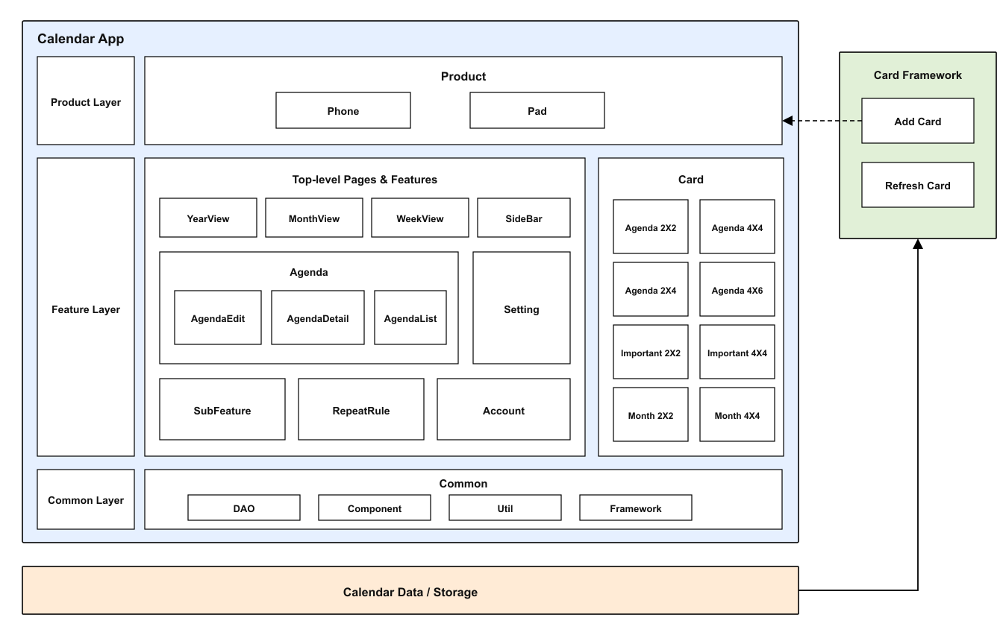

# Calendar

## Introduction
**Calendar** is a pre-installed system application in OpenHarmony, providing users with essential calendar features including event management, multi-view switching, calendar cards, and dark mode. It supports various device types such as Phone and Pad, delivering a full-scenario calendar experience.
 

### Core Capabilities
**Multi-View Calendar Display**
- Year view: View lunar calendar dates and Heavenly Stems/Earthly Branches, with quick month selection and year switching.
- Month view: View all events for a selected day, including holidays, 24 solar terms, and monthly busy/free indicators.
- Week view: View weekly event busy/free levels and conflicts, with quick time selection for creating events.
- Day view: View daily event busy/free levels and conflicts, with quick time selection for creating events.

**Event Management**
- Create regular and important events (anniversaries/countdowns) manually, with fields for basic info, location, time (including lunar calendar), reminders (including conflict reminders), account assignment, and notes. Supports modifying count-up/countdown timing of important days.
- Edit and delete events.
- Search events by keyword within the app.

**Calendar Cards**
- Support for event cards, important day cards, and month-view cards in various sizes — view schedules directly on the home screen without opening the app.

> Calendar cards support 8 size options: event cards (2×2/2×4/4×4/4×6), important day cards (2×2/2×4), and month-view cards (2×2/4×4).

**Calendar Account Management**
- Manage default account ("My Calendar"), personal accounts, and third-party accounts.
- Fine-grained account settings: name, color, reminders, etc.

**Reminder Notifications**
- Banner notification for regular events at their due time, with enhanced banner notifications for important events (effective in both lock-screen and screenshot scenarios).

**Other Capabilities**
- Dark mode (including cards), calendar settings (Chinese lunar calendar display).
- Import/Export (.ics / .vcs formats), internationalization (57 languages).
- Enhanced keyboard and mouse support (drag-and-drop, copy-paste), app continuity (seamless cross-device handoff).

## Architecture

The Calendar app adopts a layered and modular architecture, divided into four layers: Product Layer, Feature Layer, Common Capability Layer, and Base Service Layer.
 

### Layered Design

**Basic Principle**: Layers are divided based on module function reusability; each layer is divided along business boundaries between modules.

**Responsibilities**

1. **Product Layer (product/entry)**:
   - Hosts the app entry point, main pages, Ability lifecycle, and home screen widgets.
   - Responsible for integrating the feature layer and common capability layer, compiling into a deployable HAP package.

2. **Feature Layer (features/)**:
   - Hosts feature modules divided by business boundaries, each with high cohesion and low coupling, supporting product-layer customization.
   - Contains 10 independent modules: agenda, monthview, weekview, yearview, sidebar, account, card (home screen cards), importexport, repeatrule, settings.

3. **Common Capability Layer (common/)**:
   - Hosts the foundational capability set required for the calendar app to function — a mandatory core module.
   - Includes: DAO data access layer (ORM + Repository + Service), date processing (lunar calendar/holidays/timezones), layout system, service framework, router system, database, event bus, account model, utility set, etc.

4. **Base Service Layer (services/)**:
   - Provides cross-module reusable base services, using an interface-implementation separation + IDL design.
   - Includes: attachment (attachment service), network (network service with interceptor chain), timezone (timezone service).

**Relationships**
- The product layer depends downward on the feature layer and common capability layer.
- The feature layer depends downward on the common capability layer and base service layer.
- Dependencies flow top-down only; reverse dependencies are not allowed.

### Modular Design

**1. Product Layer** — located in the `product/entry` directory:

| Module | Path | Description |
| --- | --- | --- |
| Entry Point | product/entry/src/main/ets/MainAbility/ | MainAbility and AgendaAbility |
| Pages | product/entry/src/main/ets/pages/ | Main page, tab container, event detail, splash, privacy |
| System Capabilities | product/entry/src/main/ets/abilities/ | Form card Ability, static broadcast subscriber, work scheduler |
| Home Screen Widgets | product/entry/src/main/ets/widget/form/ | 8 sizes of event/important day/month-view cards |

**2. Feature Layer** — located in the `features/` directory:

| Feature Module | Path | Description |
| --- | --- | --- |
| Agenda | features/agenda | Event detail, event list, event creation, event search, event preview, attachments |
| Month View | features/monthview | Month view layout model, views, and view models |
| Week View | features/weekview | Week view data model, Gantt chart views/ViewModels, date cells |
| Year View | features/yearview | Year view layout model, single-month/single-year views, legends |
| Sidebar | features/sidebar | Sidebar main component, account management, mini month view |
| Account | features/account | Account detail and content display |
| Cards | features/card | Event cards, important day cards, month-view cards — Controllers/ViewModels/Views |
| Import/Export | features/importexport | .ics/.vcs import and export, vCalendar processing |
| Repeat Rules | features/repeatrule | Repeat rule data access, parsing, time processing |
| Settings | features/settings | Settings pages, grouped configurations (about/calendar view/reminders/timezone/network, 9 groups) |

**3. Common Capability Layer** — located in the `common/` directory:

| Module | Path | Description |
| --- | --- | --- |
| Data Access (DAO) | common/src/main/ets/dao/ | ORM annotations, 12 repositories, 11 business services, type mappers, model converters |
| Date Processing | common/src/main/ets/date/ | Calendar dates, lunar/holiday/solar terms, date formatting, timezones, holiday utilities |
| Layout System | common/src/main/ets/layout/ | Layout model/tree, layout properties/rules, breakpoint helpers, global layout environment |
| Service Framework | common/src/main/ets/service/ | Service factory, service manager, service tree, state observer, 7 service implementations |
| Router System | common/src/main/ets/router/ | Navigation page builder factory, navigation path manager, router constants/models |
| Database | common/src/main/ets/database/ | BaseDBHelper, CalendarDBHelper |
| Utilities | common/src/main/ets/util/ | ~45 utility classes (device/file/HTTP/i18n/permissions/timezone/broadcast/contacts, etc.) |

**4. Base Service Layer** — located in the `services/` directory:

| Service Module | Path | Description |
| --- | --- | --- |
| Attachment Service | services/attachment | Attachment info entities, IDL interfaces/proxies, service implementation |
| Network Service | services/network | HTTP engine, interceptor chain (permission/log/response), OneLink service |
| Timezone Service | services/timezone | Timezone service interface and implementation |

## Build
 

This project is a multi-module HAR + HAP application project, built with Hvigor, producing a system application package.

The four-layer architecture modules are compiled as follows:

1. Product Layer:
   - Divided by product type and compiled into deployable HAP packages.

2. Feature Layer:
   - Each module is divided by business boundaries and functional cohesion, compiled into HAR packages.
   - In principle, modules in this layer are optional.

3. Common Capability Layer:
   - Each module is divided by business boundaries and functional cohesion, compiled into HAR packages.
   - In principle, modules in this layer are mandatory.

4. Base Service Layer:
   - Each module is divided by business boundaries and functional cohesion, compiled into HAR packages.

### Environment Requirements
- OpenHarmony SDK (this project's `compileSdkVersion` is 23)
- DevEco Studio or command-line Hvigor toolchain

### Module Dependencies

Each module's `oh-package.json5` configures its dependencies. For example, in the entry product's `product/entry/oh-package.json5`:

```json
{
  "name": "entry",
  "version": "1.0.0",
  "dependencies": {
    "@app/common": "file:../../common",
    "@app/common.components": "file:../../commons/components",
    "@app/feature.agenda": "file:../../features/agenda",
    "@app/feature.monthview": "file:../../features/monthview",
    "@app/feature.weekview": "file:../../features/weekview",
    "@app/feature.yearview": "file:../../features/yearview",
    "@app/feature.sidebar": "file:../../features/sidebar",
    "@app/service.network": "file:../../services/network",
    "@app/service.attachment": "file:../../services/attachment",
    "@app/service.timezone": "file:../../services/timezone",
    // ...
  }
}
```

### Build Commands

Run in the project root directory:

```bash
# Use DevEco Studio to open the project and execute Build, or use the hvigor command line
hvigorw assembleHap
```

If integrated into the OpenHarmony source tree as a system component, the app can be packaged as a pre-installed system application using the platform's unified build method.

## Calendar Development

The calendar is developed in ArkTS, using the ArkUI framework for UI. Reference: [ArkUI Development Overview](https://gitcode.com/openharmony/docs/blob/master/zh-cn/application-dev/ui/arkts-ui-development-overview.md)

### Developing Based on Existing Modules

Applicable scenarios: customizing functionality provided by existing modules, such as integrating or trimming modules, replacing APIs not supported by OpenHarmony with alternatives that provide equivalent functionality, or modifying existing UI.

**Module Integration or Trimming**

1. Refer to the module dependency configuration described above to add or remove module dependencies as needed.
2. When integrating:
    - The interface export declaration for each module is located in `{module_path}\oh-package.json5`. Example: the `common` module:
    ```json
    {
      "name": "@app/common",
      "version": "1.0.0",
      "description": "Please describe the basic information.",
      "main": "./src/main/ets/TsIndex.ts", // Interface declaration file
      "author": "",
      "license": "Apache-2.0",
      "dependencies": {}
    }
    ```
3. When trimming:
    - First remove the module dependency, then clean up all calls to the interfaces declared by the removed module.
    - For example, trimming the map location selection feature from the agenda module (`features/agenda`):
        - Why: `@kit.MapKit` depends on a map SDK not supported on OpenHarmony.
        - What: Removed `@kit.MapKit`-dependent code from `LocationSetupAbility.ets`.
        ```typescript
        // Before — map location selection based on MapKit
        import { DeviceConfig, FeatureType, ... } from '@app/common';
        import { map, mapCommon, MapComponent, site } from '@kit.MapKit';
        import { AsyncCallback, BusinessError } from '@kit.BasicServicesKit';

        private mapOption?: mapCommon.MapOptions;
        private mapController?: map.MapComponentController;
        @State mapLocation: string = '';
        @State isMapVisibility: boolean = false;
        private readonly isSupportMapSelectionPoint: boolean =
          DeviceConfig.instance().isSupport(FeatureType.MAP_SELECTION_POINT);

        private mapInitCallback: AsyncCallback<map.MapComponentController> =
          async (err, mapController) => {
            this.mapController = mapController;
            this.mapController?.setMyLocationEnabled(true);
            ...
          };
        ```
        ```typescript
        // After — map location removed, location input retained
        import { ... } from '@app/common';
        import { BusinessError } from '@kit.BasicServicesKit';
        // Removed: DeviceConfig, FeatureType, @kit.MapKit, AsyncCallback
        // Removed: mapOption, mapController, mapLocation, isMapVisibility
        // Removed: isSupportMapSelectionPoint, mapInitCallback
        ```
        - Result: When creating events, users can set the location by entering an address, selecting the current location, or choosing from history.

**Replacing APIs Not Integrated in OpenHarmony**

Taking the migration of the network layer from `@kit.RemoteCommunicationKit` (rcp) to `@kit.NetworkKit` (`@ohos.net.http`) as an example:
- Why: rcp is not integrated in OpenHarmony and must be replaced with the system-native API.
- What: Removed rcp dependency, added `HttpClient` wrapping `@kit.NetworkKit`, adapted interceptor chain and HAG service.
```typescript
// Before — based on rcp
const session = rcp.createSession(config);
const request = new rcp.Request(url, method, headers, body);
const response = await session.fetch(request);
const result = response.toString();
```
```typescript
// After — based on @kit.NetworkKit
const client = new HttpClient(config);
const response = await client.execute({
  url: url,
  method: method,
  headers: headers,
  body: body
});
const result = response.toString();
```
- Result: HAG service and other functionality work normally.

**Modifying Existing UI**

Taking the bottom button layout fix in the account detail page ([AccountDetail.ets](features/account/src/main/ets/AccountDetail.ets)) as an example:
- Issue: The "Share" and "Delete" buttons overlapped with the navigation bar on the edit screen.
- Cause: The bottom buttons (`BottomBuilder()`) were placed inside the scrollable area of `buildContent()`, separated by a `Blank()`, so the buttons scrolled with the content instead of being fixed at the page bottom.
- Fix: Moved `BottomBuilder()` out of `buildContent()` into the outer `build()` method, placing it alongside the content area so the buttons stay fixed at the page bottom.
```typescript
// build() — moved BottomBuilder to the outer layer, keeping buttons fixed at page bottom
build() {
  Column() {
    Column() {
      this.NaviTitle()
      this.buildContent()
      if (this.editMode && !this.isAcceptAccount &&
        (this.showBottomShare || this.showBottomDelete)) {
        this.BottomBuilder()
      }
    }
    .padding({ bottom: this.getPadding() })
  }
}
```

## Directory

```text
calendar
├── AppScope                           # Resources, multi-language, and app-level configuration
├── product                            # Product layer
│   └── entry                          #   entry product module
├── feature                            # Feature layer
│   ├── account                        #   Account
│   ├── agenda                         #   Agenda
│   ├── card                           #   Home screen cards
│   ├── importexport                   #   Import/export (.ics / .vcs)
│   ├── monthview                      #   Month view
│   ├── repeatrule                     #   Repeat rules
│   ├── settings                       #   Settings
│   ├── sidebar                        #   Sidebar
│   ├── weekview                       #   Week view
│   └── yearview                       #   Year view
├── common                             # Common capability layer (DAO/date/layout/service framework/router/database/utilities, etc.)
├── commons                            # Common UI component library
│   ├── components                     #   Common UI components
│   └── repeatruleview                 #   Repeat rule UI components
├── services                           # Base service layer
│   ├── attachment                     #   Attachment service
│   ├── network                        #   Network service
│   └── timezone                       #   Timezone service
└── hvigor                             # Build scripts
```

## Constraints

- **Language**: ArkTS
- **Runtime**: System pre-installed app, running as a `UIAbility` process
- **Device Types**: Phone, Pad

## Contributing

Contributions of code, documentation, and more are welcome. See [Contributing](https://gitcode.com/openharmony/docs/blob/master/zh-cn/contribute/%E5%8F%82%E4%B8%8E%E8%B4%A1%E7%8C%AE.md) for details.

## Related Repositories

- [applications_calendar_data](https://gitcode.com/openharmony/applications_calendar_data)
- [arkui_ace_engine](https://gitcode.com/openharmony/arkui_ace_engine)
