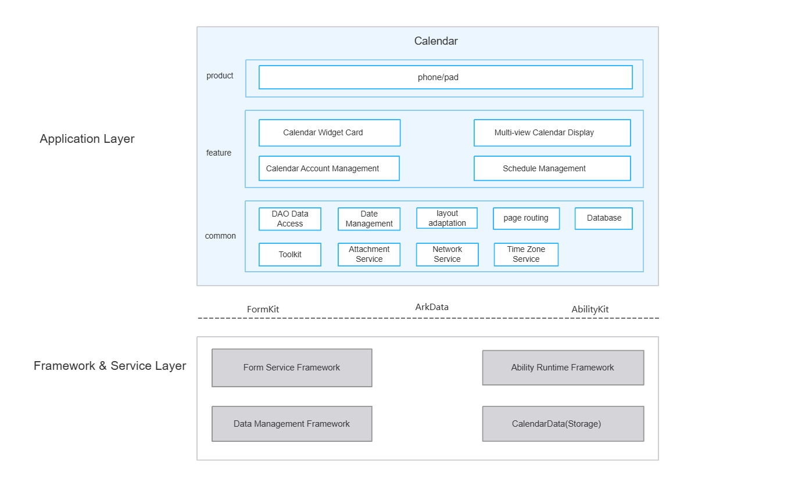

# Calendar

## Introduction

**Calendar** (bundle name: `com.ohos.calendar`) is a pre-installed **system application** in OpenHarmony. The app manages event data through the system calendar service, providing calendar cards, multi-view calendar display, event management, and calendar account management capabilities, and is adapted for phone and tablet device types.

This application is a pre-installed system app. Users can access Calendar from the home screen icon, home screen cards, notification bar, and other entry points.

### Core Capabilities

**Calendar Cards**
- Provides 8 sizes of home screen widgets, allowing users to view event schedules and important day countdowns directly on the home screen without opening the app.

**Multi-View Calendar Display**
- Supports four view modes — year, month, week, and day — allowing users to switch freely between different time granularities.
- Supports phone sidebar, all events list, and quick navigation to the current date.

**Event Management**
- Supports viewing, creating, editing, and deleting regular events and important days (anniversaries/countdowns), with fields for title, location, time (including lunar calendar), repeat rules, reminders, account assignment, notes, and more.
- Supports event search and important day timing (count-up/countdown switching).

**Calendar Account Management**
- Supports creation, deletion, and fine-grained settings for default account, personal accounts, and third-party accounts.
- Supports viewing all events under an account.


## Architecture

The Calendar app adopts a layered and modular design, organized by product type, business features, and common capabilities, as shown below:


### Application Layer Design

The app is divided into three layers: product layer, feature layer, and common layer:

| Layer | Key Directories / Components | Description |
|-------|------------------------------|-------------|
| Product Layer | `product/entry` | Adapted for phone and tablet device types |
| Feature Layer | `features/agenda`, `features/monthview`, `features/weekview`, `features/yearview`, `features/sidebar`, `features/account`, `features/card`, `features/importexport`, `features/repeatrule`, `features/settings` | Calendar cards, multi-view calendar display, event management, calendar account management |
| Common Layer | `common`, `services` | DAO data access, date processing, layout adaptation, page routing, database, utilities, attachment service, network service, timezone service |

**Feature Layer Module Details**:

| Core Capability | Key Modules and Classes | Description |
|-----------------|------------------------|-------------|
| Calendar Cards | features/card | Three-layer Controller/ViewModel/View architecture for event cards, important day cards, and month-view cards; 8 desktop cards in 4 sizes (2×2, 2×4, 4×4, 4×6) |
| Multi-View Calendar Display | features/monthview, features/weekview, features/yearview, features/sidebar | Month view: `MonthlyViewModel` / `SingleMonthlyViewModel`; Week view: `GanttViewModel` / `DateViewModel`; Year view: `YearViewModel`; Sidebar: `SideBarMonthViewModel` — driving view rendering and layout adaptation |
| Event Management | features/agenda, features/importexport, features/repeatrule, features/settings | Event CRUD, search, import/export, repeat rule parsing, settings configuration (calendar display, views, reminders, network, about, etc.) |
| Calendar Account Management | features/account | Detail viewing, deletion, and fine-grained settings for default/personal/third-party accounts |


### Relationship with Other Apps

| Item | Description |
|------|-------------|
| Callable by other apps | Yes. `MainAbility` declares `exported=true`; system apps can launch Calendar via Want |
| Supported Want parameters | `action.system.home` (home screen icon), `ohos.want.action.viewData` (open .ics/.vcs files), `ohos.want.action.sendData` (receive event data) |
| Calling scenarios | Home screen icon, home screen cards, notification bar, .ics/.vcs file opening |
| Cross-process services | Provides background task scheduling via `CalendarWorkSchedulerExtensionAbility`, system broadcast reception via `StaticSubscriber`, and privacy statement entry via `CalendarPrivacyAbility` |

## Build

This project is a multi-module HAR + HAP application project, built with Hvigor, producing the `com.ohos.calendar` system application package.

### Environment Requirements
- OpenHarmony SDK (this project uses `compileSdkVersion` "26.0.0", `compatibleSdkVersion` 23, `targetSdkVersion` 23)
- DevEco Studio or command-line Hvigor toolchain
- System signing certificates (see `signature/`)

### Build Commands

Run in the project root directory:

```bash
# Open the project in DevEco Studio and run Build, or use the hvigor command line
hvigorw assembleHap
```

## Calendar Development

Calendar is developed in **ArkTS**, with UI based on the ArkUI Stage model. The app uses `MainAbility` to host the main interface, with feature modules in `features/` handling event management and view display, and the common capability layer (`CommonService`, `CalendarDBHelper`, `LayoutModel`, etc.) in `common/` maintaining data, layout, and service consistency. Reference: [ArkUI Development Overview](https://gitcode.com/openharmony/docs/blob/master/zh-cn/application-dev/ui/arkts-ui-development-overview.md)

### Developing Based on Existing Modules

Applicable scenarios: customizing existing capabilities, such as modifying default event settings, adjusting view display rules, extending settings items, or replacing system APIs.

Identify the change point: locate by business boundary — `product/entry` (entry and home page), `features/` (feature modules), `common/` (common capabilities), or `services/`.

Below are some common modification scenarios:

**Scenario 1: Modify the event creation chain**
   - The event creation page entry is at `features/agenda/src/main/ets/CreateAgenda/view/CreateAgendaRoot.ets`
   - Event creation business logic is at `features/agenda/src/main/ets/CreateAgenda/viewmodel/CreateAgendaViewModel.ets`
   - Reminder editing is at `features/agenda/src/main/ets/CreateAgenda/view/AgendaReminderInfo.ets`

   For example, to adjust the rounding rule for the default start time of a new event, modify `CreateAgendaViewModel.getStartDateByCombine()`:
   ```typescript
   // CreateAgendaViewModel.ets — rounding logic for default start time of new events
   public getStartDateByCombine(dateParam: number, needSaveTime: SaveTimeType): number {
     let nowTimeMills = dateParam;
     // [Modification] Change the rounding interval from half an hour (MILLS_PER_HOUR / 2) to 15 minutes
     const halfHourMills = MILLS_PER_HOUR / 2;
     if (nowTimeMills % halfHourMills < MILLS_PER_MINUTE) {
       return Math.trunc(nowTimeMills / MILLS_PER_MINUTE) * MILLS_PER_MINUTE;
     }
     return Math.trunc(nowTimeMills / halfHourMills) * halfHourMills + (isNeedFloor ? halfHourMills : 0);
   }
   ```
**Scenario 2: Modify settings and reminder configuration**

   - Reminder settings are at `features/settings/src/main/ets/groupConfig/remind.ets`
   - Calendar view settings are at `features/settings/src/main/ets/groupConfig/calendarView.ets`

   For example, to change the default reminder time, adjust `defaultVal` in `remind.ets`:
   ```typescript
   // remind.ets — defaultVal controls the default reminder time (unit: minutes)
   {
     compId: CompId.SETTINGS_DEFAULT_REMINDER_TIME,
     title: $r('app.string.preferences_default_reminder_title'),
     action: eventAction.DIALOG,
     settingKey: settingKeys.defaultRemindTime,
     // [Modification] Change the default reminder time from 10 minutes to 15 minutes
     defaultVal: 15,
     syncState(val: number) {
       GlobalData.instance().set(GlobalDataKeys.DEFAULT_REMIND_TIME, val);
     }
   }
   ```
**Scenario 3: Modify UI components**

   - Common UI components are at `commons/components/src/main/ets/`, and page components for each feature module are in their respective `features/*/src/main/ets/` directories.
   - Settings dialogs are at `features/settings/src/main/ets/dialogs/` (e.g., `DefaultRemindTime.ets`, `StartOfWeek.ets`).

   For example, to modify the all-day event default reminder dialog, adjust in `AllDayEventsDefaultRemindTime.ets`:
   ```typescript
   // AllDayEventsDefaultRemindTime.ets — all-day event default reminder dialog
   @Component
   export struct AllDayEventsDefaultRemindTime {
     // [Modification] Adjust the initial value of the all-day event default reminder time (minutes)
     @StorageLink('allDayEventsDefaultRemindTime') allDayEventsDefaultRemindTime: number = 0;

     build() {
       Column() {
         RadioListDialog({
           title: $r('app.string.eu3_cl_ab_settings_alldayeventremindertime'),
           compId: CompId.ALL_DAY_EVENTS_DEFAULT_REMIND_TIME,
           style: RadioListStyle.Menu,
           options: DEFAULT_ALL_DAY_REMINDER_OPTIONS,
           radioGroup: this.RADIO_GROUP,
           onChange: (value: number) => {
             GlobalData.instance().set(GlobalDataKeys.ALL_DAY_EVENTS_DEFAULT_REMIND_TIME, value);
             SettingStore.INSTANCE.set(settingKeys.allDayEventsDefaultRemindTime, value);
             this.callback(value)
           }
         })
       }
     }
   }
   ```

Common modification entry points:

| Target | Path |
|--------|------|
| App Home Page | `product/entry/src/main/ets/pages/MainPage.ets` |
| Event Creation Page | `features/agenda/src/main/ets/CreateAgenda/view/CreateAgendaRoot.ets` |
| Event Detail Page | `features/agenda/src/main/ets/AgendaDetail/view/AgendaDetail.ets` |
| Month / Week / Year Views | `features/monthview/`, `features/weekview/`, `features/yearview/` |
| Home Screen Cards | `features/card/`, `product/entry/src/main/ets/widget/form/` |
| Settings & Reminders | `features/settings/src/main/ets/` |

### Developing New Feature Capabilities

Applicable scenarios: adding new calendar capabilities, extending card types, adding differentiated interactions, or adapting to new device types.

> **Note**: The current project uses a `product + features + common + services` directory structure, with the main entry point at `product/entry`. New capabilities should generally extend within the existing layering. To add a new product type HAP, create a corresponding directory under `product/` and register it in `build-profile.json5`.

**Scenario 1: Extend Business Capabilities (Most Common)**

1. Add or supplement pages, ViewModels, or controller logic in `features/`.
2. For persistence, extend `CommonService` or add new data repositories in `common/src/main/ets/dao/`.
3. For cards, extend both `features/card/` and `product/entry/src/main/ets/widget/form/` in sync.
4. Add corresponding unit test cases in `product/entry/src/ohosTest/`.
5. Configure / verify Ability entry points

   The project entry points are declared in `product/entry/src/main/module.json5`. When extending capabilities, verify that the permissions, Abilities, Forms, and shortcut configurations meet the needs of the new scenario:

   ```json
   {
     "module": {
       "name": "entry",
       "type": "entry",
       "srcEntry": "./ets/Application/Application.ets",
       "mainElement": "MainAbility",
       "deviceTypes": [
         "default",
         "tablet"
       ],
       "abilities": [
         {
           "name": "MainAbility",
           "srcEntry": "./ets/MainAbility/MainAbility.ets",
           "exported": true,
           "launchType": "singleton",
           "continuable": true
         },
         {
           "name": "AgendaAbility",
           "srcEntry": "./ets/MainAbility/AgendaAbility.ets",
           "exported": true,
           "launchType": "specified"
         }
       ],
       "extensionAbilities": [
         {
           "name": "AllFormAbility",
           "srcEntry": "./ets/abilities/form/AllFormAbility.ets",
           "type": "form"
         },
         {
           "name": "CalendarWorkSchedulerExtensionAbility",
           "srcEntry": "./ets/abilities/workscheduler/CalendarWorkSchedulerExtensionAbility.ets",
           "type": "workScheduler"
         }
       ]
     }
   }
   ```

**Scenario 2: Customize UI**

After completing business capabilities and Ability configuration, extend the home page, view pages, event editing pages, or card pages following the UI component modification approach in the previous section "Developing Based on Existing Modules".

To add a new standalone page:
1. Create a new page file under the corresponding module's `pages/` directory.
2. If system route registration is required, declare it in `resources/base/profile/main_pages.json`.
3. Launch from `MainPage`, `NavPathManager`, or Want routing.

## Directory

```text
calendar
├─AppScope                              # App-level configuration and multi-language resources
│  ├─app.json5                          # bundleName, version, etc.
│  └─resources/                         # Global strings / icons and other resources
├─product                               # Product layer
│  └─entry/                             # entry product module (HAP)
│     └─src/main/ets/
│        ├─Application/                 # App lifecycle management
│        ├─MainAbility/                 # App main entry
│        ├─pages/                       # Home page
│        ├─abilities/                   # Form lifecycle management, work scheduler, static broadcast subscriber
│        └─widget/form/                 # 8 sizes of home screen cards
├─features                              # Feature layer (10 independent HAR modules)
│  ├─account/                           # Account management
│  ├─agenda/                            # Event management
│  ├─card/                              # Home screen cards
│  ├─importexport/                      # Import/export (.ics / .vcs)
│  ├─monthview/                         # Month view
│  ├─repeatrule/                        # Repeat rules
│  ├─settings/                          # Settings
│  ├─sidebar/                           # Sidebar
│  ├─weekview/                          # Week view
│  └─yearview/                          # Year view
├─common                                # Common capability layer
│  └─src/main/ets/
│     ├─dao/                            # Data access layer (CommonService, DBUtils, Parser)
│     ├─date/                           # Date processing (lunar/solar calendar/holidays/solar terms/timezone)
│     ├─layout/                         # Layout adaptation (LayoutModel, LayoutModelTree, LayoutRule)
│     ├─router/                         # Page routing (NavPathManager, RouterConstants, NavPageBuilderFactory)
│     ├─database/                       # Database (CalendarDBHelper, BaseDBHelper)
│     └─util/                           # Utilities (device/file/HTTP/permissions/timezone/broadcast/contacts, etc.)
├─commons                               # Common UI component library
│  ├─components/                        # Common UI components
│  └─repeatruleview/                    # Repeat rule UI components
├─services                              # Attachment/Network/Timezone services
│  ├─attachment/                        # Attachment service
│  ├─network/                           # Network service
│  └─timezone/                          # Timezone service
├─signature                             # Signing certificates and profiles
├─hvigor                                # Build tool configuration
├─build-profile.json5                   # Project configuration
├─oh-package.json5
├─OAT.xml                               # Open source compliance audit
├─LICENSE
├─README.md                             # English documentation
└─README_zh.md                          # Chinese documentation
```

## Constraints

- **Language**: ArkTS
- **Runtime**: System pre-installed app (`com.ohos.calendar`), depending on calendar data service, network and other system capabilities
- **Device Types**: Phone, tablet (see `product/entry/src/main/module.json5`)
- **Form Factor Adaptation**: Different devices will change page layout; when modifying UI, validation must cover multiple form factors
- **Permissions**: The main permissions required by Calendar are as follows (see `product/entry/src/main/module.json5`)

  | Permission | Authorization | Usage |
  |------------|--------------|-------|
  | [ohos.permission.READ_WHOLE_CALENDAR](https://gitcode.com/openharmony/docs/blob/master/en/application-dev/calendarmanager/calendarmanager-overview.md) | User grant | Read all calendar information |
  | [ohos.permission.WRITE_WHOLE_CALENDAR](https://gitcode.com/openharmony/docs/blob/master/en/application-dev/calendarmanager/calendarmanager-overview.md) | User grant | Add, remove, or modify all calendar events |
  | ohos.permission.NOTIFICATION_CONTROLLER | System grant | Manage calendar notification subscription and reminder settings |

- **Supported Import/Export Formats**: .ics, .vcs

## Contributing

Contributions of code, documentation, and more are welcome. See [Contributing](https://gitcode.com/openharmony/docs/blob/master/zh-cn/contribute/%E5%8F%82%E4%B8%8E%E8%B4%A1%E7%8C%AE.md) for details.

## Related Repositories

- [applications_calendar_data](https://gitcode.com/openharmony/applications_calendar_data)
