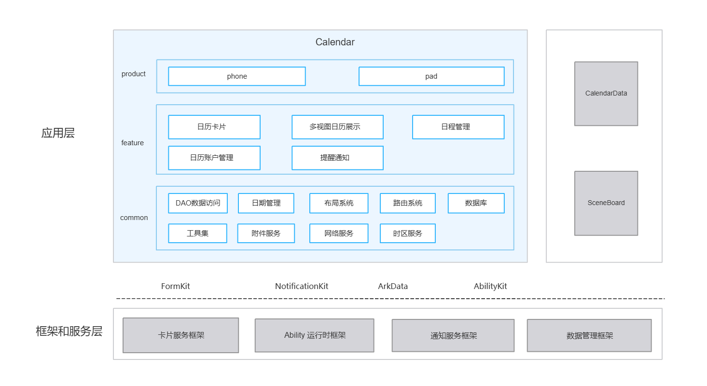

# 日历（Calendar）

## 简介

**日历**（包名：`com.ohos.calendar`）是 OpenHarmony 中预置的 **系统应用**，应用通过系统日历服务管理日程数据，提供日历卡片、多视图日历展示、日程管理、日历账户管理能力，并适配手机、平板设备形态。

本应用为系统预置应用，用户可从桌面图标、桌面卡片、通知栏等场景进入日历。

### 核心能力

**日历卡片**
- 提供 8 种尺寸的桌面小组件，用户在桌面即可查看日程安排与重要日倒计时，无需打开应用。

**多视图日历展示**
- 支持年视图、月视图、周视图、日视图四种视图模式，可在不同时间粒度间自由切换。
- 支持手机侧边栏、所有日程列表、快速返回今日视图。

**日程管理**
- 支持查看、创建、编辑、删除普通日程与重要日（纪念日/倒数日），可设置标题、地点、时间（含农历）、重复规则、提醒、账户归属、备注等信息。
- 支持日程搜索与重要日计时（正计时/倒计时切换）。

**日历账户管理**
- 支持默认账户、个人账户、三方账户的创建、删除与精细化设置。
- 支持查看账户下所有日程。


## 架构说明

日历应用采用分层与模块化设计，按产品形态、业务特性与公共能力组织代码，如图：


### 应用层分层设计

整体可划分为产品层、特性层、公共层：

| 层次 | 主要目录 / 组件 | 说明 |
|------|--------------|------|
| 产品层 | `product/entry` | 适配手机、平板形态 |
| 特性层 | `features/agenda`、`features/monthview`、`features/weekview`、`features/yearview`、`features/sidebar`、`features/account`、`features/card`、`features/importexport`、`features/repeatrule`、`features/settings` | 日历卡片、多视图日历展示、日程管理、日历账户管理 |
| 公共层 | `common`、`services` | DAO 数据访问、日期处理、布局适配、页面路由、数据库、工具集、附件服务、网络服务、时区服务 |

**特性层模块说明**：

| 核心能力 | 主要模块与关键类 | 说明 |
|---------|----------------|------|
| 日历卡片 | features/card | 日程卡/重要日卡/月视图卡的 Controller/ViewModel/View 三层架构，8 款桌面卡片（含 2×2、2×4、4×4、4×6 四种尺寸） |
| 多视图日历展示 | features/monthview, features/weekview, features/yearview, features/sidebar | 月视图 `MonthlyViewModel` / `SingleMonthlyViewModel`，周视图 `GanttViewModel` / `DateViewModel`，年视图 `YearViewModel`，侧边栏 `SideBarMonthViewModel` 驱动各视图渲染与布局适配 |
| 日程管理 | features/agenda, features/importexport, features/repeatrule, features/settings | 日程 CRUD、搜索、导入导出、重复规则解析、设置项配置（含日历显示、视图、提醒、网络、关于等） |
| 日历账户管理 | features/account | 默认/个人/三方账户的详情查看、删除与精细化设置 |


### 与其它应用的关系

| 项目 | 说明 |
|------|------|
| 是否允许其它应用调用 | 允许。`MainAbility` 声明 `exported=true`，系统应用可通过 Want 拉起日历 |
| 支持的 Want 参数 | `action.system.home`（桌面图标）、`ohos.want.action.viewData`（打开 .ics/.vcs 文件）、`ohos.want.action.sendData`（接收日程数据） |
| 调用场景 | 桌面图标、桌面卡片、通知栏、.ics/.vcs 文件打开 |
| 跨进程服务 | 通过 `CalendarWorkSchedulerExtensionAbility` 提供后台延时任务调度，`StaticSubscriber` 接收系统广播，`CalendarPrivacyAbility` 提供隐私声明入口 |

## 编译构建

本工程为多模块 HAR + HAP 应用工程，使用 Hvigor 构建，产物为 `com.ohos.calendar` 系统应用包。

### 环境要求
- OpenHarmony SDK（本工程 `compileSdkVersion` 为 "26.0.0"，`compatibleSdkVersion` 为 23，`targetSdkVersion` 为 23）
- DevEco Studio 或命令行 Hvigor 工具链
- 系统签名证书（见 `signature/`）

### 编译命令

在工程根目录执行：

```bash
# 使用 DevEco Studio 打开工程后执行 Build，或使用 hvigor 命令行
hvigorw assembleHap
```

## 日历开发

日历采用 **ArkTS** 语言开发，UI 基于 ArkUI Stage 模型。应用通过 `MainAbility` 承载主界面，通过 `features/` 各特性模块完成日程管理、视图展示等业务，并通过 `common/` 公共能力层中的 `CommonService`、`CalendarDBHelper`、`LayoutModel` 等保持数据、布局与服务一致。开发可参考：[ArkUI 开发概述](https://gitcode.com/openharmony/docs/blob/master/zh-cn/application-dev/ui/arkts-ui-development-overview.md)

### 基于已有模块的开发

适用场景：对已有能力做功能定制，例如修改日程默认配置、调整视图展示规则、扩展设置项、替换系统 API 等。

明确改动点：按业务边界定位到 `product/entry`（入口与首页）、`features/`（各特性模块）、`common/`（公共能力）或 `services/`。

以下列举一些常见的修改场景：

**场景1：修改日程创建链路**
   - 页面入口位于 `features/agenda/src/main/ets/CreateAgenda/view/CreateAgendaRoot.ets`
   - 业务流程管理位于 `features/agenda/src/main/ets/CreateAgenda/viewmodel/CreateAgendaViewModel.ets`
   - 提醒编辑位于 `features/agenda/src/main/ets/CreateAgenda/view/AgendaReminderInfo.ets`

   例如，需调整新建日程的默认开始时间取整规则，可在 `CreateAgendaViewModel.getStartDateByCombine()` 中修改：
   ```typescript
   // CreateAgendaViewModel.ets — 新建日程默认开始时间的取整逻辑
   public getStartDateByCombine(dateParam: number, needSaveTime: SaveTimeType): number {
     let nowTimeMills = dateParam;
     // 【修改点】将取整间隔从半小时（MILLS_PER_HOUR / 2）改为 15 分钟
     const halfHourMills = MILLS_PER_HOUR / 2;
     if (nowTimeMills % halfHourMills < MILLS_PER_MINUTE) {
       return Math.trunc(nowTimeMills / MILLS_PER_MINUTE) * MILLS_PER_MINUTE;
     }
     return Math.trunc(nowTimeMills / halfHourMills) * halfHourMills + (isNeedFloor ? halfHourMills : 0);
   }
   ```
**场景2：修改设置与提醒配置**

   - 提醒设置位于 `features/settings/src/main/ets/groupConfig/remind.ets`
   - 日历视图设置位于 `features/settings/src/main/ets/groupConfig/calendarView.ets`

   例如，需修改默认提醒时间，在 `remind.ets` 中调整 `defaultVal`：
   ```typescript
   // remind.ets — defaultVal 控制默认提醒时间（单位：分钟）
   {
     compId: CompId.SETTINGS_DEFAULT_REMINDER_TIME,
     title: $r('app.string.preferences_default_reminder_title'),
     action: eventAction.DIALOG,
     settingKey: settingKeys.defaultRemindTime,
     // 【修改点】将默认提醒时间从 10 分钟改为 15 分钟
     defaultVal: 15,
     syncState(val: number) {
       GlobalData.instance().set(GlobalDataKeys.DEFAULT_REMIND_TIME, val);
     }
   }
   ```
**场景3：修改 UI 组件**

   - 通用 UI 组件位于 `commons/components/src/main/ets/`，各特性模块的页面组件位于对应 `features/*/src/main/ets/` 目录。
   - 设置页弹框位于 `features/settings/src/main/ets/dialogs/`（如 `DefaultRemindTime.ets`、`StartOfWeek.ets`）。

   例如，需要修改全天事件的默认提醒弹框，在 `AllDayEventsDefaultRemindTime.ets` 中调整：
   ```typescript
   // AllDayEventsDefaultRemindTime.ets — 全天事件默认提醒弹框
   @Component
   export struct AllDayEventsDefaultRemindTime {
     // 【修改点】调整全天事件默认提醒时间的初始值（分钟）
     @StorageLink('allDayEventsDefaultRemindTime') allDayEventsDefaultRemindTime: number = 0;

     build() {
       Column() {
         RadioListDialog({
           title: $r('app.string.eu3_cl_ab_settings_alldayeventremindertime'),
           compId: CompId.ALL_DAY_EVENTS_DEFAULT_REMIND_TIME,
           style: RadioListStyle.Menu,
           options: DEFAULT_ALL_DAY_REMINDER_OPTIONS,
           radioGroup: this.RADIO_GROUP,
           onChange: (value: number) => {
             GlobalData.instance().set(GlobalDataKeys.ALL_DAY_EVENTS_DEFAULT_REMIND_TIME, value);
             SettingStore.INSTANCE.set(settingKeys.allDayEventsDefaultRemindTime, value);
             this.callback(value)
           }
         })
       }
     }
   }
   ```

常用修改入口：

| 目标 | 路径 |
|------|------|
| 应用首页 | `product/entry/src/main/ets/pages/MainPage.ets` |
| 日程创建页 | `features/agenda/src/main/ets/CreateAgenda/view/CreateAgendaRoot.ets` |
| 日程详情页 | `features/agenda/src/main/ets/AgendaDetail/view/AgendaDetail.ets` |
| 月视图 / 周视图 / 年视图 | `features/monthview/`、`features/weekview/`、`features/yearview/` |
| 桌面卡片 | `features/card/`、`product/entry/src/main/ets/widget/form/` |
| 设置与提醒 | `features/settings/src/main/ets/` |

### 新特性能力的开发

适用场景：新增日历相关能力、扩展卡片形态、补充差异化交互或适配新设备形态。

> **说明**：当前工程采用 `product + features + common + services` 目录结构，产品入口主要在 `product/entry`。新能力一般按现有分层扩展；若新增产品形态 HAP，可在 `product/` 下增加对应目录并在 `build-profile.json5` 中注册。

**场景1：扩展业务能力（最常见）**

1. 在 `features/` 中新增或补充页面、ViewModel 或控制器逻辑。
2. 如涉及持久化，在 `common/src/main/ets/dao/` 中扩展 `CommonService` 或新增数据仓库。
3. 如涉及卡片，在 `features/card/` 与 `product/entry/src/main/ets/widget/form/` 中同步扩展。
4. 在 `product/entry/src/ohosTest/` 中补充对应的单元测试用例。
5. 配置 / 确认 Ability 入口

   本工程入口已在 `product/entry/src/main/module.json5` 中声明，扩展能力时通常只需确认权限、Ability、Form 与快捷方式配置是否满足新场景：

   ```json
   {
     "module": {
       "name": "entry",
       "type": "entry",
       "srcEntry": "./ets/Application/Application.ets",
       "mainElement": "MainAbility",
       "deviceTypes": [
         "default",
         "tablet"
       ],
       "abilities": [
         {
           "name": "MainAbility",
           "srcEntry": "./ets/MainAbility/MainAbility.ets",
           "exported": true,
           "launchType": "singleton",
           "continuable": true
         },
         {
           "name": "AgendaAbility",
           "srcEntry": "./ets/MainAbility/AgendaAbility.ets",
           "exported": true,
           "launchType": "specified"
         }
       ],
       "extensionAbilities": [
         {
           "name": "AllFormAbility",
           "srcEntry": "./ets/abilities/form/AllFormAbility.ets",
           "type": "form"
         },
         {
           "name": "CalendarWorkSchedulerExtensionAbility",
           "srcEntry": "./ets/abilities/workscheduler/CalendarWorkSchedulerExtensionAbility.ets",
           "type": "workScheduler"
         }
       ]
     }
   }
   ```

**场景2：定制 UI**

在完成业务能力与 Ability 配置后，按上一节「基于已有模块的开发」中的 UI 组件修改方式扩展首页、各视图页面、日程编辑页或卡片页面即可。

若需新增独立页面：
1. 在对应模块 `pages/` 下新增页面文件；
2. 如需系统路由注册，在 `resources/base/profile/main_pages.json` 中声明；
3. 由 `MainPage`、`NavPathManager` 或 Want 路由拉起。

## 目录

```text
calendar
├─AppScope                              # 应用级配置与多语言资源
│  ├─app.json5                          # bundleName、版本号等
│  └─resources/                         # 全局字符串 / 图标等资源
├─product                               # 产品层
│  └─entry/                             # entry 产品模块（HAP）
│     └─src/main/ets/
│        ├─Application/                 # 应用生命周期管理
│        ├─MainAbility/                 # 应用主入口
│        ├─pages/                       # 首页
│        ├─abilities/                   # 服务卡片生命周期管理、延时任务调度、静态广播订阅
│        └─widget/form/                 # 8 种尺寸桌面卡片
├─features                              # 特性层（10 个独立 HAR 模块）
│  ├─account/                           # 账户管理
│  ├─agenda/                            # 日程管理
│  ├─card/                              # 桌面卡片
│  ├─importexport/                      # 导入导出（.ics / .vcs）
│  ├─monthview/                         # 月视图
│  ├─repeatrule/                        # 重复规则
│  ├─settings/                          # 设置
│  ├─sidebar/                           # 侧边栏
│  ├─weekview/                          # 周视图
│  └─yearview/                          # 年视图
├─common                                # 公共能力层
│  └─src/main/ets/
│     ├─dao/                            # 数据访问层（CommonService、DBUtils、Parser）
│     ├─date/                           # 日期处理（农历/公历/节日/节气/时区）
│     ├─layout/                         # 布局适配（LayoutModel、LayoutModelTree、LayoutRule）
│     ├─router/                         # 页面路由（NavPathManager、RouterConstants、NavPageBuilderFactory）
│     ├─database/                       # 数据库（CalendarDBHelper、BaseDBHelper）
│     └─util/                           # 工具集（设备/文件/HTTP/权限/时区/广播/联系人等）
├─commons                               # 公共 UI 组件库
│  ├─components/                        # 通用 UI 组件
│  └─repeatruleview/                    # 重复规则 UI 组件
├─services                              # 附件/网络/时区服务
│  ├─attachment/                        # 附件服务
│  ├─network/                           # 网络服务
│  └─timezone/                          # 时区服务
├─signature                             # 签名证书与 profile
├─hvigor                                # 构建工具配置
├─build-profile.json5                   # 工程配置
├─oh-package.json5
├─OAT.xml                               # 开源合规审计
├─LICENSE
├─README.md                             # 英文说明文档
└─README_zh.md                          # 中文说明文档
```

## 约束

- **语言版本**：ArkTS
- **运行形态**：系统预置应用（`com.ohos.calendar`），依赖日历数据服务、网络等系统能力
- **设备类型**：手机、平板（见 `product/entry/src/main/module.json5`）
- **形态适配**：不同设备会改变页面布局，修改 UI 时需覆盖多形态验证
- **权限**：日历所需的主要权限如下（见 `product/entry/src/main/module.json5`）

  | 权限 | 授权方式 | 使用场景 |
  |------|---------|------|
  | [ohos.permission.READ_WHOLE_CALENDAR](https://gitcode.com/openharmony/docs/blob/master/zh-cn/application-dev/calendarmanager/calendarmanager-overview.md) | 用户授权 | 读取所有的日历信息 |
  | [ohos.permission.WRITE_WHOLE_CALENDAR](https://gitcode.com/openharmony/docs/blob/master/zh-cn/application-dev/calendarmanager/calendarmanager-overview.md) | 用户授权 | 添加、移除或更改所有的日历活动 |
  | ohos.permission.NOTIFICATION_CONTROLLER | 系统授权 | 管理日历通知订阅与提醒设置 |

- **支持的导入导出格式**：.ics、.vcs

## 参与贡献

欢迎广大开发者贡献代码、文档等，具体的贡献流程和方式请参见[参与贡献](https://gitcode.com/openharmony/docs/blob/master/zh-cn/contribute/%E5%8F%82%E4%B8%8E%E8%B4%A1%E7%8C%AE.md)。

## 相关仓

- [applications_calendar_data](https://gitcode.com/openharmony/applications_calendar_data)
