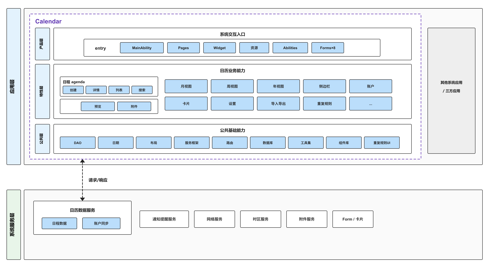
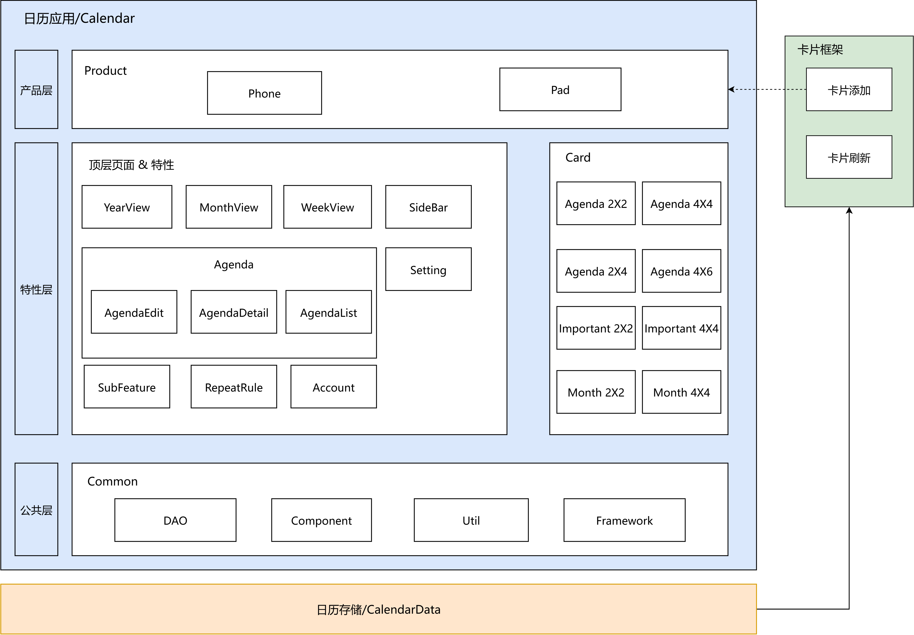
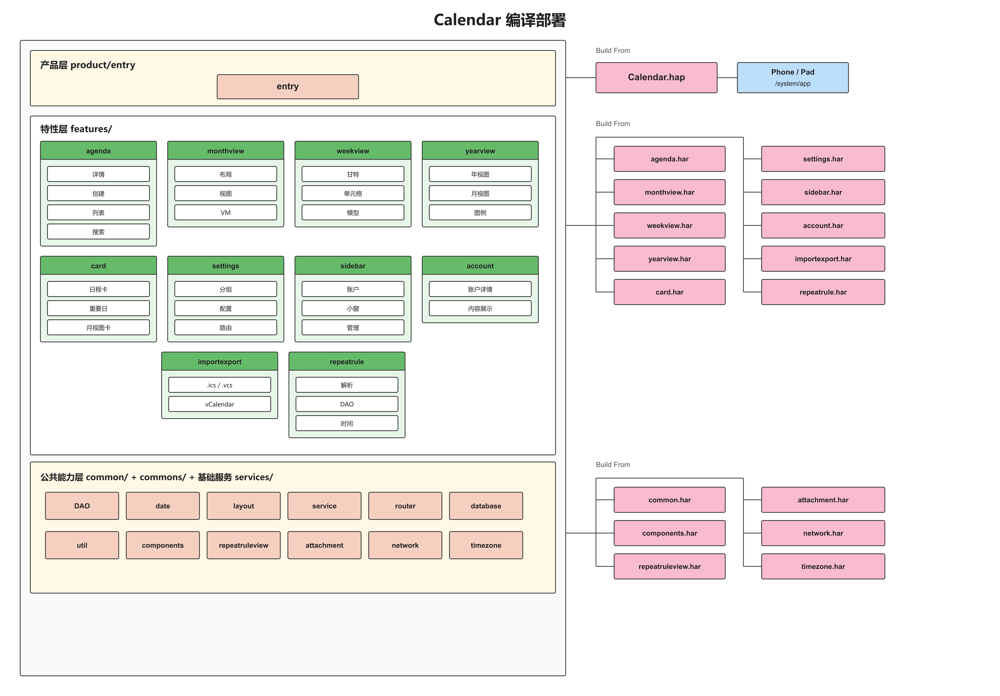

# 日历（Calendar）

## 简介
**日历** 是 OpenHarmony 标准系统中预置的系统应用，为用户提供基础的日历功能，包括日程管理、多视图切换、日历卡片、深色模式等能力。支持 Phone、Pad等多种设备形态，提供全场景日历体验。
 

### 核心能力
**多视图日历展示**
- 年视图：查看农历初一、天干地支，支持快速选择月份、切换年份。
- 月视图：查看某天所有日程，节假日、二十四节气以及整月的闲忙程度。
- 周视图：查看当周日程闲忙程度和冲突情况，支持快速选择时间创建日程。
- 日视图：查看当天日程闲忙程度和冲突情况，支持快速选择时间创建日程。

**日程管理**
- 支持手工创建普通日程和重要日（纪念日/倒数日），可设置基本信息、地点、时间（含农历）、提醒（含冲突提醒）、账户归属、备注等。支持修改重要日的正计时/倒计时。
- 支持编辑、删除日程。
- 支持日程搜索，通过关键字在应用内搜索目标日程。

**日历卡片**
- 支持日程卡片、重要日卡片、月视图卡片等多种尺寸的桌面小组件，用户无需打开应用即可查看日程安排。

> 日历卡片支持 8 种尺寸规格：日程卡片（2×2/2×4/4×4/4×6）、重要日卡片（2×2/2×4）、月视图卡片（2×2/4×4）。

**日历账户管理**
- 支持默认账户（我的日历）、个人账户、三方账户的创建与管理。
- 支持账户精细化设置：名称、颜色、是否提醒等。

**提醒通知**
- 普通日程到期后有横幅通知，重要日程有更强的横幅通知（锁屏/截屏场景均生效）。

**其他能力**
- 深色模式（含卡片）、历法设置（中国农历显示）。
- 导入导出（.ics / .vcs 格式）、国际化（57 种语言）。
- 键鼠操作增强（拖拽、复制粘贴）、应用接续（跨设备无缝流转）。

## 架构说明

日历应用采用分层和模块化的架构设计，整体分为四层：产品层、特性层、公共能力层和基础服务层。
 

### 分层设计

**基本原则**：层与层之间按照模块功能的可复用程度进行划分，每一层按照模块间的业务边界划分。

**职责**

1. **产品层（product/entry）**：
   - 承载应用入口、主页面、Ability 生命周期和桌面小组件。
   - 负责集成特性层和公共能力层，编译为可部署的 HAP 包。

2. **特性层（features/）**：
   - 承载按业务边界拆分的功能模块，每个模块高内聚、低耦合，支持产品层定制。
   - 包含 10 个独立模块：agenda（日程）、monthview（月视图）、weekview（周视图）、yearview（年视图）、sidebar（侧边栏）、account（账户）、card（桌面卡片）、importexport（导入导出）、repeatrule（重复规则）、settings（设置）。

3. **公共能力层（common/）**：
   - 承载日历应用运行所需的基础能力集，是必选的核心模块。
   - 包含：DAO 数据访问层（ORM + Repository + Service）、日期处理（农历/节日/时区）、布局系统、服务框架、路由系统、数据库、事件总线、账户模型、工具集等。

4. **基础服务层（services/）**：
   - 提供跨模块复用的基础服务，采用接口-实现分离 + IDL 设计。
   - 包含：attachment（附件服务）、network（网络服务，含拦截器链）、timezone（时区服务）。

**关系**
- 产品层向下依赖特性层和公共能力层。
- 特性层向下依赖公共能力层和基础服务层。
- 依赖方向自上而下，不允许反向依赖。

### 模块化设计

**1. 产品层** — 位于 `product/entry` 目录：

| 模块 | 路径 | 说明 |
| --- | --- | --- |
| 主入口 | product/entry/src/main/ets/MainAbility/ | 主 Ability 和 AgendaAbility |
| 页面 | product/entry/src/main/ets/pages/ | 主页面、主Tab容器、日程详情页、闪屏页、隐私页 |
| 系统能力 | product/entry/src/main/ets/abilities/ | 桌面卡片Ability、静态广播订阅、延时任务调度 |
| 桌面小组件 | product/entry/src/main/ets/widget/form/ | 8种尺寸的日程/重要日/月视图卡片 |

**2. 特性层** — 位于 `features/` 目录：

| 特性模块 | 路径 | 说明 |
| --- | --- | --- |
| 日程 | features/agenda | 日程详情、日程列表、创建日程、搜索日程、日程预览、日程附件 |
| 月视图 | features/monthview | 月视图布局模型、视图和视图模型 |
| 周视图 | features/weekview | 周视图数据模型、甘特图视图/ViewModel、日期单元格 |
| 年视图 | features/yearview | 年视图布局模型、单月/单年视图、图例 |
| 侧边栏 | features/sidebar | 侧边栏主组件、账户管理、月视图小窗 |
| 账户 | features/account | 账户详情和内容展示 |
| 桌面卡片 | features/card | 日程卡、重要日卡、月视图卡的Controller/ViewModel/View |
| 导入导出 | features/importexport | .ics/.vcs 导入导出、vCalendar处理 |
| 重复规则 | features/repeatrule | 重复规则数据访问、解析、时间处理 |
| 设置 | features/settings | 设置页面、分组配置（关于/日历视图/提醒/时区/网络等9组） |

**3. 公共能力层** — 位于 `common/` 目录：

| 公共能力模块 | 路径 | 说明 |
| --- | --- | --- |
| 数据访问层 (DAO) | common/src/main/ets/dao/ | ORM注解、12个数据仓库、11个业务服务、类型映射器、模型转换器 |
| 日期处理 | common/src/main/ets/date/ | 日历日期、农历/节日/节气、日期格式化、时区、节假日工具 |
| 布局系统 | common/src/main/ets/layout/ | 布局模型/树、布局属性/规则、断点辅助、全局布局环境 |
| 服务框架 | common/src/main/ets/service/ | 服务工厂、服务管理器、服务树、状态观察者、7个服务实现 |
| 路由系统 | common/src/main/ets/router/ | 导航页面构建工厂、导航路径管理器、路由常量/模型 |
| 数据库 | common/src/main/ets/database/ | BaseDBHelper、CalendarDBHelper |
| 工具集 | common/src/main/ets/util/ | ~45个工具类（设备/文件/HTTP/国际化/权限/时区/广播/联系人等） |

**4. 基础服务层** — 位于 `services/` 目录：

| 服务模块 | 路径 | 说明 |
| --- | --- | --- |
| 附件服务 | services/attachment | 附件信息实体、IDL接口/代理、服务实现 |
| 网络服务 | services/network | HTTP引擎、拦截器链（权限/日志/响应）、OneLink服务 |
| 时区服务 | services/timezone | 时区服务接口和实现 |

## 编译构建
 

本工程为多模块 HAR + HAP 应用工程，使用 Hvigor 构建，产物为系统应用包。

日历四层架构的各模块在编译态时，分别：

1. 产品层：
   - 该层按照不同产品进行划分，分别编译为可部署的 HAP 包。

2. 特性层：
   - 各模块按照业务边界和功能内聚的原则进行划分，分别编译为 HAR 包。
   - 原则上，该层的模块是可选模块。

3. 公共能力层：
   - 各模块按照业务边界和功能内聚的原则进行划分，分别编译为 HAR 包。
   - 原则上，该层的模块是必选模块。

4. 基础服务层：
   - 各模块按照业务边界和功能内聚的原则进行划分，分别编译为 HAR 包。

### 环境要求
- OpenHarmony SDK（本工程 `compileSdkVersion` 为 23）
- DevEco Studio 或命令行 Hvigor 工具链

### 模块间依赖

各个模块的 `oh-package.json5` 可配置当前模块的依赖模块。例如：entry 产品的 `product/entry/oh-package.json5` 中：

```json
{
  "name": "entry",
  "version": "1.0.0",
  "dependencies": {
    "@app/common": "file:../../common",
    "@app/common.components": "file:../../commons/components",
    "@app/feature.agenda": "file:../../features/agenda",
    "@app/feature.monthview": "file:../../features/monthview",
    "@app/feature.weekview": "file:../../features/weekview",
    "@app/feature.yearview": "file:../../features/yearview",
    "@app/feature.sidebar": "file:../../features/sidebar",
    "@app/service.network": "file:../../services/network",
    "@app/service.attachment": "file:../../services/attachment",
    "@app/service.timezone": "file:../../services/timezone",
    // ...
  }
}
```

### 编译命令

在工程根目录执行：

```bash
# 使用 DevEco Studio 打开工程后执行 Build，或使用 hvigor 命令行
hvigorw assembleHap
```

若作为 OpenHarmony 系统部件合入源码树，可参考平台统一构建方式，将本应用作为预置系统应用打包进镜像。

## 日历开发

日历采用 ArkTS 语言开发，基于 ArkUI 框架构建 UI 界面，可参考：[ArkUI 开发概述](https://gitcode.com/openharmony/docs/blob/master/zh-cn/application-dev/ui/arkts-ui-development-overview.md)

### 基于已有模块的开发
适用场景：对已有的模块提供的功能进行功能定制，例如：对已有模块进行新集成或裁剪、对OpenHarmony系统不支持的API用其他能实现相同功能的API进行替换、对已有的UI进行修改。

**对已有模块的集成或者裁剪**

1. 参考上文模块间依赖的配置方式，对模块的依赖进行修改，按需新增或删除。
2. 新集成时：
    - 各模块的接口导出文件声明位于 `{模块路径}\oh-package.json5` 中。例如：`common` 模块：
    ```json
    {
      "name": "@app/common",
      "version": "1.0.0",
      "description": "Please describe the basic information.",
      "main": "./src/main/ets/TsIndex.ts", // 接口声明文件
      "author": "",
      "license": "Apache-2.0",
      "dependencies": {}
    }
    ```
3. 裁剪时：
    - 在裁剪模块时，需要先移除模块依赖，再清理对被集成模块声明的接口的全部调用。
    - 例如，裁剪日程模块（`features/agenda`）中的地图选点功能：
        - 原因：`@kit.MapKit` 依赖地图 SDK，OpenHarmony 系统不支持。
        - 内容：移除 `LocationSetupAbility.ets` 中依赖 `@kit.MapKit` 的代码。
        ```typescript
        // 裁剪前 — 依赖 MapKit 的地图选点
        import { DeviceConfig, FeatureType, ... } from '@app/common';
        import { map, mapCommon, MapComponent, site } from '@kit.MapKit';
        import { AsyncCallback, BusinessError } from '@kit.BasicServicesKit';
        
        private mapOption?: mapCommon.MapOptions;
        private mapController?: map.MapComponentController;
        @State mapLocation: string = '';
        @State isMapVisibility: boolean = false;
        private readonly isSupportMapSelectionPoint: boolean =
          DeviceConfig.instance().isSupport(FeatureType.MAP_SELECTION_POINT);
        
        private mapInitCallback: AsyncCallback<map.MapComponentController> =
          async (err, mapController) => {
            this.mapController = mapController;
            this.mapController?.setMyLocationEnabled(true);
            ...
          };
        ```
        ```typescript
        // 裁剪后 — 移除地图选点，保留位置输入
        import { ... } from '@app/common';
        import { BusinessError } from '@kit.BasicServicesKit';
        // 移除：DeviceConfig, FeatureType, @kit.MapKit, AsyncCallback
        // 移除：mapOption, mapController, mapLocation, isMapVisibility
        // 移除：isSupportMapSelectionPoint, mapInitCallback
        ```
        - 结果：用户创建日程时，可通过输入地点、选择当前地点或从历史地点中选择来设置位置。

**对 OpenHarmony 未集成的 API 进行替换**

以网络层从 `@kit.RemoteCommunicationKit`（rcp）迁移至 `@kit.NetworkKit`（`@ohos.net.http`）为例：
- 原因：OpenHarmony 未集成 rcp，需用系统原生 API 替代。
- 内容：移除 rcp 依赖，新增 `HttpClient` 封装 `@kit.NetworkKit`，适配拦截器链及 HAG 服务。
```typescript
// 替换前 — 基于 rcp
const session = rcp.createSession(config);
const request = new rcp.Request(url, method, headers, body);
const response = await session.fetch(request);
const result = response.toString();
```
```typescript
// 替换后 — 基于 @kit.NetworkKit
const client = new HttpClient(config);
const response = await client.execute({
  url: url,
  method: method,
  headers: headers,
  body: body
});
const result = response.toString();
```
- 结果：HAG 服务等功能正常运行。

**对已有的UI进行修改**

以账户详情页（[AccountDetail.ets](features/account/src/main/ets/AccountDetail.ets)）底部按钮布局修复为例：
- 问题：编辑界面中"分享"和"删除"按钮与导航条重合。
- 原因：底部按钮（`BottomBuilder()`）放在 `buildContent()` 内部滚动区域中，使用 `Blank()` 分隔，导致按钮位置紧跟内容滚动，未固定在页面底部。
- 修复：将 `BottomBuilder()` 从 `buildContent()` 移至外层 `build()` 方法中，与内容区域并列，确保按钮固定在页面底部。
```typescript
// build() — 将 BottomBuilder 提至外层，按钮固定在页面底部
build() {
  Column() {
    Column() {
      this.NaviTitle()
      this.buildContent()
      if (this.editMode && !this.isAcceptAccount &&
        (this.showBottomShare || this.showBottomDelete)) {
        this.BottomBuilder()
      }
    }
    .padding({ bottom: this.getPadding() })
  }
}
```

## 目录

```text
calendar
├── AppScope                           # 资源、多语言与应用级配置
├── product                            # 产品层
│   └── entry                          #   entry 产品模块
├── feature                            # 特性层
│   ├── account                        #   账户
│   ├── agenda                         #   日程
│   ├── card                           #   桌面卡片
│   ├── importexport                   #   导入导出（.ics / .vcs）
│   ├── monthview                      #   月视图
│   ├── repeatrule                     #   重复规则
│   ├── settings                       #   设置
│   ├── sidebar                        #   侧边栏
│   ├── weekview                       #   周视图
│   └── yearview                       #   年视图
├── common                             # 公共能力层（DAO/日期/布局/服务框架/路由/数据库/工具集等）
├── commons                            # 公共UI组件库
│   ├── components                     #   通用UI组件
│   └── repeatruleview                 #   重复规则UI组件
├── services                           # 基础服务层
│   ├── attachment                     #   附件服务
│   ├── network                        #   网络服务
│   └── timezone                       #   时区服务
└── hvigor                             # 工程构建脚本
```

## 约束

- **语言版本**：ArkTS
- **运行形态**：系统预置应用，通过 `UIAbility` 进程运行
- **设备类型**：Phone、Pad

## 参与贡献

欢迎广大开发者贡献代码、文档等，具体的贡献流程和方式请参见[参与贡献](https://gitcode.com/openharmony/docs/blob/master/zh-cn/contribute/%E5%8F%82%E4%B8%8E%E8%B4%A1%E7%8C%AE.md)。

## 相关仓

- [applications_calendar_data](https://gitcode.com/openharmony/applications_calendar_data)
- [arkui_ace_engine](https://gitcode.com/openharmony/arkui_ace_engine)
